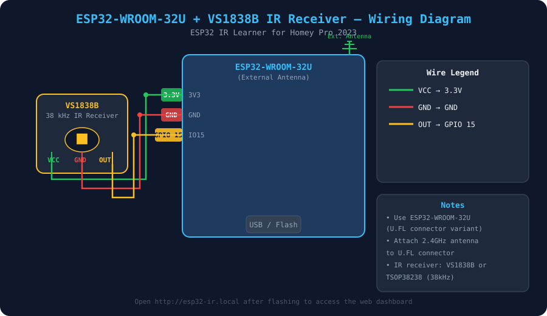

# ESP32-U IR Learner for Homey Pro 2023

> Capture IR remote control signals with an **ESP32-WROOM-32U** (external antenna) + **VS1838B** IR receiver and automatically forward them to **Homey Pro 2023** via built-in Webhooks so your Homey IR blaster can replay any signal.



---

## Features

- Captures IR signals from any remote (50+ protocols: NEC, Sony, Samsung, LG, Panasonic, RC5/6, HVAC, etc.)
- Converts raw timing data to **Pronto HEX** – the standard format used by Homey IR blasters
- Pushes signal to Homey Pro 2023 automatically via **built-in Logic Webhooks** (no extra Homey app required)
- Built-in **Wi-Fi setup portal** (WiFiManager) – no hardcoded credentials
- Embedded **web dashboard** at `http://esp32-ir.local` with live signal log and one-click send
- Settings (Homey IP + webhook tag) stored in ESP32 flash (survives reboots)
- Built with **PlatformIO** / Arduino framework

---

## Hardware

| Component | Details |
|-----------|---------|
| MCU | ESP32-WROOM-**32U** (U.FL external antenna variant) |
| Antenna | 2.4 GHz U.FL / IPEX antenna (any ~3dBi omnidirectional) |
| IR Receiver | VS1838B **or** TSOP38238 (38 kHz demodulator) |

### Wiring

| VS1838B Pin | ESP32 Pin |
|-------------|-----------|
| VCC | 3.3V |
| GND | GND |
| OUT (DATA) | **GPIO 15** |

See `wiring-diagram.svg` for the full visual schematic.

---

## Software Setup

### 1. Clone and open in PlatformIO

```bash
git clone https://github.com/ArduinoCell/esp32IRlearner.git
cd esp32IRlearner
```

Open the folder in **VS Code** with the PlatformIO extension, or build/upload from the CLI:

```bash
pio run --target upload
pio device monitor
```

### 2. First-boot Wi-Fi setup

On first boot the ESP32 broadcasts a Wi-Fi hotspot called **`ESP32-IR-Learner`**.

1. Connect to it from your phone or laptop.
2. A captive portal opens automatically (or navigate to `192.168.4.1`).
3. Choose your home Wi-Fi network and enter the password.
4. The ESP32 saves the credentials and restarts.

### 3. Configure Homey IP

1. Open `http://esp32-ir.local` (or the IP shown in the serial monitor).
2. Enter your **Homey Pro's local IP address** in the *Homey IP Address* field.
3. Leave the *Webhook Event Name* as `ir_learned` (or pick your own).
4. Click **Save to ESP32**.

---

## Usage – Learning a Signal

1. Point your IR remote at the VS1838B receiver.
2. Press any button.
3. The web dashboard shows the captured signal instantly:
   - Protocol & hex code
   - **Pronto HEX string** (ready to paste into Homey)
4. The Pronto HEX is automatically POSTed to Homey.

---

## Homey Pro 2023 Setup

### A – Receive signal via Webhook and store it

Homey's built-in **Logic Webhooks** receive the payload without any extra app.

**Flow 1: Store the learned Pronto HEX**

| Block | Setting |
|-------|---------|
| **WHEN** | *Webhook* `ir_learned` is received |
| **THEN** | *Set Variable* `last_pronto_hex` = `[[tag]]` |

> The ESP32 sends the full Pronto HEX string as the `tag` query parameter.

### B – Replay the signal with the Homey IR blaster

**Flow 2: Trigger on demand**

| Block | Setting |
|-------|---------|
| **WHEN** | (your trigger – e.g. a virtual button / voice / automation) |
| **THEN** | *IR Blaster: Send IR signal* → paste the Pronto HEX from `last_pronto_hex` |

> Supported Homey IR blaster apps: **Broadlink**, **Homey Bridge IR**, or any app that accepts Pronto HEX.

---

## Project Structure

```
esp32IRlearner/
├── platformio.ini          # PlatformIO build config + library dependencies
├── wiring-diagram.svg      # Hardware wiring diagram
├── README.md
└── src/
    ├── main.cpp            # Main firmware – IR capture, WebServer, Homey push
    ├── pronto.h            # Raw IR → Pronto HEX converter
    └── web_page.h          # Embedded HTML/CSS/JS dashboard
```

---

## Dependencies (auto-installed by PlatformIO)

| Library | Purpose |
|---------|---------|
| `IRremoteESP8266` | IR capture + protocol decoding (50+ protocols) |
| `ArduinoJson` | JSON serialization for API responses + Homey payload |
| `WiFiManager` | Captive-portal Wi-Fi setup |
| `PubSubClient` | Optional MQTT support |

---

## Serial Monitor Output

```
=== ESP32-U IR Learner for Homey Pro 2023 ===
Connected to Wi-Fi.  IP: 192.168.1.42
mDNS: http://esp32-ir.local
IR receiver active on GPIO 15
HTTP server started on port 80

[IR] ── Signal captured ─────────────────
     Protocol : NEC (32 bits)
     Hex Code : 0x20DF10EF
     Pronto   : 0000 006D 0022 0000 0156 00AB ...
[IR] ─────────────────────────────────────
[Homey] POST http://192.168.1.10/api/manager/logic/webhook/ir_learned
[Homey] Response: 200
```

---

## License

MIT – free to use, modify, and distribute.
